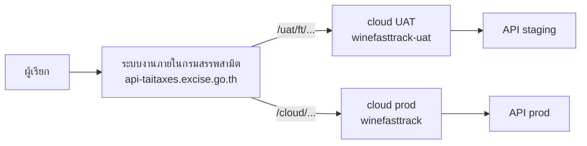
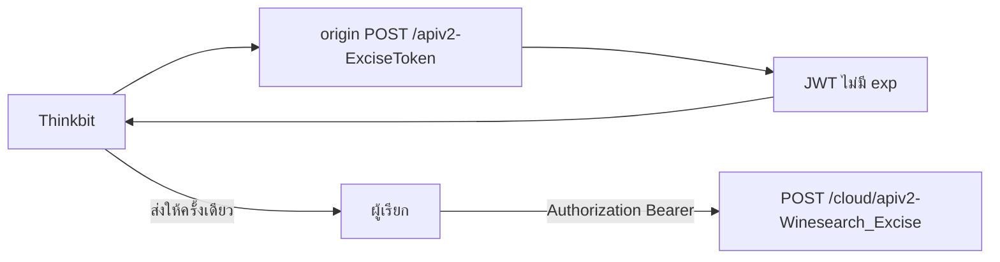
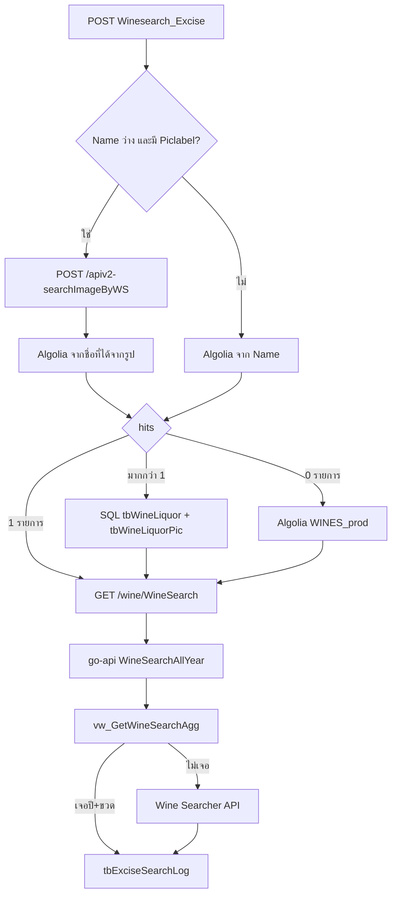

# ค้นหาไวน์และราคาแนะนำขายเบื้องต้น

Wine Search API Specification · ฉบับภายใน Thinkbit

เอกสารภายในทีม **Thinkbit** — อย่าส่งให้ผู้เรียก API (ผู้เรียกใช้ `CLIENT_SPECT`)

| | |
|---|---|
| **Audience** | Thinkbit (dev / ops) |
| **คู่สัญญา** | กรมสรรพสามิต — ระบบใช้ภายในหน่วยงาน |
| **ผู้เรียก** | ระบบงานที่ได้รับสิทธิ์เชื่อม API |
| **Purpose** | ค้นหาไวน์และราคาแนะนำขายเบื้องต้น (THB) จากชื่อ หรือจากรูปฉลาก |
| **Source** | [excise-wine-nodejs-api](https://github.com/THINKBITTH/excise-wine-nodejs-api/blob/c3950ca0d80cce3f35eaf1f76c98caff400fef15/src/app/controller/wse.ts) (`wse.ts`) · ราคาจาก [excise-wine-go-api](https://github.com/THINKBITTH/excise-wine-go-api/blob/d57c5add1f1b0252a5e0d03ce141d74abe5b1cfb/api/functions/wine/handler.go#L49) (`GET /wine/WineSearch`) |
| **Date** | 2026-08-20 |

ลิงก์ไฟล์ข้าม repo เป็น permalink ตาม commit — ถ้า HEAD ถูกแก้ ลิงก์ยังชี้จุดเดิม

| Repo | Branch | Commit |
|---|---|---|
| [excise-wine-nodejs-api](https://github.com/THINKBITTH/excise-wine-nodejs-api) | `staging/aws` | [`c3950ca`](https://github.com/THINKBITTH/excise-wine-nodejs-api/commit/c3950ca0d80cce3f35eaf1f76c98caff400fef15) |
| [excise-wine-go-api](https://github.com/THINKBITTH/excise-wine-go-api) | `staging/aws` | [`d57c5ad`](https://github.com/THINKBITTH/excise-wine-go-api/commit/d57c5add1f1b0252a5e0d03ce141d74abe5b1cfb) |
| [excise-wine-proxy](https://github.com/THINKBITTH/excise-wine-proxy) | `main` | [`cf51c2d`](https://github.com/THINKBITTH/excise-wine-proxy/commit/cf51c2d95fcb5176c904265e9ef3ed83a02ef102) |

---

## 1. ผู้ใช้งาน

API นี้อยู่ในงานของกรมสรรพสามิต ใช้ค้นไวน์และราคาแนะนำ **ภายในโครงข่ายของกรม** ไม่ได้เปิดเป็นบริการสาธารณะ

ผู้ใช้งานฝั่งเรียก API คือ **ระบบงานที่ได้รับสิทธิ์** ไม่ผูกว่าต้องเป็นหน่วยงานใดหน่วยงานหนึ่ง โดยทั่วไปคือระบบที่กรมอนุญาตให้เชื่อมเข้ามาทางระบบงานภายในกรมสรรพสามิต

| บทบาท | คือใคร | ทำอะไร |
|---|---|---|
| คู่สัญญา | กรมสรรพสามิต | เจ้าของงาน ใช้งานภายใน |
| ผู้พัฒนา / ops | Thinkbit | origin, proxy, ออก token, ดูแล environment |
| ผู้เรียก (caller) | ระบบที่ได้รับ Access Token | `POST` ค้นไวน์ที่ระบบงานภายในกรมสรรพสามิต |

ผู้เรียกโดยทั่วไป:

- ยิงได้เฉพาะระบบงานภายในกรมสรรพสามิต (`api-taitaxes.excise.go.th`) ไม่เรียก cloud / origin โดยตรง
- มี Access Token คนละ token ต่อ environment
- ไม่เรียก `apiv2-ExciseToken` เอง — Thinkbit ออก token แล้วส่งให้ระบบนั้นเก็บไปใช้
- `uid` ใน token ใช้ระบุระบบผู้เรียกใน search log ควร unique ต่อระบบ เช่น `sys-001`

Thinkbit ออก token ตามข้อ 3 แล้วส่งให้ระบบนั้น ผู้เรียกยิงค้นไวน์ที่ระบบงานภายในกรมสรรพสามิตตามข้อ 2

---

## 2. Access — แยก UAT / Production

ผู้เรียกยิงได้เฉพาะ **ระบบงานภายในกรมสรรพสามิต** (`api-taitaxes.excise.go.th`) — ทีม Thinkbit ดูแลระบบงานภายในกรม / cloud / origin

| Environment | Client URL | location ระบบงานภายในกรม | Cloud | Origin | Token |
|---|---|---|---|---|---|
| UAT | `POST https://api-taitaxes.excise.go.th/uat/ft/apiv2-Winesearch_Excise` | [`/uat/ft/`](https://github.com/THINKBITTH/excise-wine-proxy/blob/cf51c2d95fcb5176c904265e9ef3ed83a02ef102/remote/gateway/conf.d/api-taitaxes-excise-go-th.conf#L146-L155) | `winefasttrack-uat.excise.go.th` ([`default.conf`](https://github.com/THINKBITTH/excise-wine-proxy/blob/cf51c2d95fcb5176c904265e9ef3ed83a02ef102/aws/uat/nginx/default.conf)) | `excise-wine-nodejs-api-staging.devthinkbit.com` | gen ที่ origin **staging** |
| Production | `POST https://api-taitaxes.excise.go.th/cloud/apiv2-Winesearch_Excise` | มีใน [`api-taitaxes-excise-go-th.conf`](https://github.com/THINKBITTH/excise-wine-proxy/blob/cf51c2d95fcb5176c904265e9ef3ed83a02ef102/remote/gateway/conf.d/api-taitaxes-excise-go-th.conf) | `winefasttrack.excise.go.th` ([`prod.conf`](https://github.com/THINKBITTH/excise-wine-proxy/blob/cf51c2d95fcb5176c904265e9ef3ed83a02ef102/aws/uat/nginx/prod.conf)) | `excise-wine-nodejs-api.devthinkbit.com` | gen ที่ origin **prod** |

Origin path ทั้งสอง env คือ `/apiv2-Winesearch_Excise`



Token / ข้อมูล / `JWT_SECRET` **คนละ env** — token UAT ใช้บน prod ไม่ได้ (ถ้า secret ไม่เหมือนกัน)

### 2.1 Hop

**Production (live)**

`api-taitaxes` `/cloud/apiv2-Winesearch_Excise` → `winefasttrack.excise.go.th` → `excise-wine-nodejs-api.devthinkbit.com/apiv2-Winesearch_Excise`

**UAT**

`api-taitaxes` `/uat/ft/apiv2-Winesearch_Excise` → `winefasttrack-uat.excise.go.th/uat/ft/apiv2-Winesearch_Excise` → `excise-wine-nodejs-api-staging.devthinkbit.com/apiv2-Winesearch_Excise`

ระบบงานภายในกรมมี [`/uat/ft/`](https://github.com/THINKBITTH/excise-wine-proxy/blob/cf51c2d95fcb5176c904265e9ef3ed83a02ef102/remote/gateway/conf.d/api-taitaxes-excise-go-th.conf#L146-L155) แล้ว Cloud ต้องมี location `/uat/ft/apiv2-Winesearch_Excise` ชี้ origin staging (เฉพาะกว่า `/uat/ft/` ที่ชี้ frontend) — snippet ที่ `DRAFT.md` ข้อ 3

Nginx **ไม่ได้** ใส่ token ให้ — ส่ง header จาก client ต่อไปเท่านั้น

### 2.2 ไฟล์ proxy

| Layer | ไฟล์ |
|---|---|
| ระบบงานภายในกรมสรรพสามิต | [`remote/gateway/conf.d/api-taitaxes-excise-go-th.conf`](https://github.com/THINKBITTH/excise-wine-proxy/blob/cf51c2d95fcb5176c904265e9ef3ed83a02ef102/remote/gateway/conf.d/api-taitaxes-excise-go-th.conf) |
| Cloud UAT | [`aws/uat/nginx/default.conf`](https://github.com/THINKBITTH/excise-wine-proxy/blob/cf51c2d95fcb5176c904265e9ef3ed83a02ef102/aws/uat/nginx/default.conf) |
| Cloud prod | [`aws/uat/nginx/prod.conf`](https://github.com/THINKBITTH/excise-wine-proxy/blob/cf51c2d95fcb5176c904265e9ef3ed83a02ef102/aws/uat/nginx/prod.conf) |

snippet location บน cloud UAT (`/uat/ft/apiv2-Winesearch_Excise`) อยู่ที่ `DRAFT.md` ข้อ 3

### 2.3 ขีดจำกัด

| Layer | timeout | body |
|---|---|---|
| ระบบงานภายในกรมสรรพสามิต (server-level) | 600s | **10 MB** — เพดานฝั่งผู้เรียกทั้ง UAT และ prod |
| Cloud location | 600s | 50 MB |
| Origin | — | `express.json({ limit: '100mb' })` |

ค้นจากรูปหรือหลายรายการอาจใช้เวลาใกล้เพดาน 600 วินาที

`apiv2-ExciseToken` **ไม่มี location** ทั้งระบบงานภายในกรมสรรพสามิต และ cloud — ออก token ที่ origin ตาม env (ข้อ 3.1)

HTTP ที่ระบบงานภายในกรมสรรพสามิต / cloud ถูก `301` ไป HTTPS (`TLSv1.2` / `TLSv1.3`)

---

## 3. Authentication — ต้องใช้ access token

Endpoint ค้นไวน์ **บังคับ** `Authorization: Bearer <access_token>`  
ไม่มี token / token ไม่ผ่าน → **ไม่ค้นไวน์** ตอบ `401` ทันที

```
Authorization: Bearer <jwt>
```

### 3.1 ออก token ให้ผู้เรียก (`apiv2-ExciseToken`)

ผู้เรียก **ไม่เรียก endpoint นี้เอง** — Thinkbit gen ที่ origin แล้วส่ง JWT ให้ระบบนั้นเก็บไปใช้

| | |
|---|---|
| Method | `POST` |
| Origin UAT | `https://excise-wine-nodejs-api-staging.devthinkbit.com/apiv2-ExciseToken` |
| Origin prod | `https://excise-wine-nodejs-api.devthinkbit.com/apiv2-ExciseToken` |
| Auth ของตัว endpoint | **ไม่มี** — ใครถึง origin ได้ก็ mint JWT ได้ |
| Proxy `/cloud/` `/uat/ft/` | **ไม่มี location ของ `apiv2-ExciseToken`** → ผู้เรียกที่ระบบงานภายในกรมสรรพสามิต เรียกออก token ไม่ได้ |

[`src/app/routes/apiv2.ts` L44](https://github.com/THINKBITTH/excise-wine-nodejs-api/blob/c3950ca0d80cce3f35eaf1f76c98caff400fef15/src/app/routes/apiv2.ts#L44)

```
apiv2.post("/apiv2-ExciseToken", Apiv2Controller.ExciseToken);
```



**ขั้นตอนออกให้ผู้เรียก 1 ระบบ**

1. กำหนด ident ของระบบผู้เรียก — ใช้ `uid` ใน search log (`Create_by` / `Update_by`) ควร unique ต่อระบบ เช่น `sys-001`
2. ยิง `POST /apiv2-ExciseToken` ที่ **origin ของ env นั้น** (staging สำหรับ UAT, prod สำหรับ production) — อย่ายิงผ่านระบบงานภายในกรมสรรพสามิต / cloud
3. ได้ `data.token` แล้วส่งให้ผู้เรียกทางช่องทางลับ (อย่า commit / อย่าใส่ใน `CLIENT_SPECT`)
4. ผู้เรียกใส่ `Authorization: Bearer <data.token>` ทุกครั้งที่ค้นไวน์ — **ใช้ได้ยาว ไม่มี `expiresIn`**

**Request body** (`additionalProperties: false`, ทุก field เป็น string และ required)

| Field | ใช้ทำอะไร? |
|---|---|
| `token` | ฝังใน JWT payload ชื่อ `token` — API ค้นไวน์ไม่ได้ใช้ต่อ |
| `uid` | ฝังใน JWT → ตอนค้นไวน์เขียนลง `tbExciseSearchLog.Create_by` / `Update_by` |
| `name` | ฝังใน JWT payload ชื่อ `name` |

```json
{
  "token": "sys-001",
  "uid": "sys-001",
  "name": "Caller System"
}
```

**JWT payload ที่ถูก sign** (`jwt.sign` ด้วย `JWT_SECRET`, **ไม่ใส่ `expiresIn`**)

```json
{
  "token": "sys-001",
  "uid": "sys-001",
  "name": "Caller System",
  "time": "<Date ตอน gen>",
  "url": "<process.env.URL>",
  "iat": 0
}
```

โค้ดที่เคยหมดอายุถูก comment ไว้แล้ว:

[`Apiv2Controller.ts` L2162–L2166](https://github.com/THINKBITTH/excise-wine-nodejs-api/blob/c3950ca0d80cce3f35eaf1f76c98caff400fef15/src/app/controller/Apiv2Controller.ts#L2162-L2166)

```
          // let token = await jwt.sign(token_model, process.env.JWT_SECRET as string, { expiresIn: process.env.EXPIRE_TIME })
          let token = sign(token_model, process.env.JWT_SECRET as string);
```

**Response สำเร็จ**

```json
{
  "code": 200,
  "data": { "token": "eyJhbGciOiJIUzI1NiIsInR5cCI6IkpXVCJ9..." },
  "message": "Token Genarated",
  "status": true
}
```

| HTTP | เมื่อไหร่? |
|---|---|
| `200` | sign สำเร็จ — ใช้ `data.token` เป็น Bearer |
| `400` | body ไม่ครบ / type ผิด / field นอก spec |
| `500` | init Firebase หรือต่อ DB ไม่ได้ (เปิด pool แต่ไม่ได้ validate uid กับตาราง) |

**อายุและ revoke**

| เรื่อง | พฤติกรรมจริง |
|---|---|
| หมดอายุ | **ไม่มี** — gen ครั้งเดียวใช้ได้ยาว |
| ตรวจตอนค้นไวน์ | `jwt.verify(token, JWT_SECRET)` อย่างเดียว ไม่เช็ค DB / ไม่เช็ค `exp` |
| revoke รายผู้เรียก | **ไม่มี revoke list** — ออก token ใหม่ให้ไม่ได้ทำให้ของเก่าใช้ไม่ได้ |
| revoke ทั้งระบบ | rotate `JWT_SECRET` → JWT เก่าทั้งหมด `401 Invalid Token` แล้วต้อง gen ใหม่ให้ทุกคน |
| อย่าเปิด `apiv2-ExciseToken` ออก `/cloud/` | endpoint นี้ไม่มี auth ของตัวเอง |

### 3.2 ตรวจ token ตอนค้นไวน์ ([excise-wine-nodejs-api](https://github.com/THINKBITTH/excise-wine-nodejs-api))

1. Route ชี้ไปที่ handler `wse` โดยตรง

[`src/app/routes/apiv2.ts` L43](https://github.com/THINKBITTH/excise-wine-nodejs-api/blob/c3950ca0d80cce3f35eaf1f76c98caff400fef15/src/app/routes/apiv2.ts#L43)

```
apiv2.post("/apiv2-Winesearch_Excise", Apiv2Controller.Winesearch_Excise);
```

[`Apiv2Controller.ts` L2082](https://github.com/THINKBITTH/excise-wine-nodejs-api/blob/c3950ca0d80cce3f35eaf1f76c98caff400fef15/src/app/controller/Apiv2Controller.ts#L2082)

```
  static Winesearch_Excise: RequestHandler = wse;
```

2. Handler ดึง token **ก่อน** validate body / ค้นข้อมูล  
   ไม่มี `Authorization` → `401`  
   verify ไม่ผ่าน → `401`

[`wse.ts` L23–L45](https://github.com/THINKBITTH/excise-wine-nodejs-api/blob/c3950ca0d80cce3f35eaf1f76c98caff400fef15/src/app/controller/wse.ts#L23-L45)

```
const resolveToken = (request: Request, response: Response<any>) => {
  let authHeader = request.headers["authorization"] as string;
  if (!authHeader) {
    response.status(401).send("You are not authenticate !");
    return;
  }
  const token = authHeader.split(" ")[1];
  jwt.verify(token, process.env.JWT_SECRET as string, (err) => {
    if (err) {
      response.status(401).send("Invalid Token");
      throw new Error("Invalid Token");
    }
  });
  // ...
  return jwt.decode(token) as TokenData | null;
};
```

3. Gate ของทั้ง endpoint: มี decoded token เท่านั้นถึงจะทำงานต่อ ไม่มี → `401`

[`wse.ts` L566–L571](https://github.com/THINKBITTH/excise-wine-nodejs-api/blob/c3950ca0d80cce3f35eaf1f76c98caff400fef15/src/app/controller/wse.ts#L566-L571)

```
const wse: RequestHandler = async (request, response) => {
  try {
    let decodedToken = resolveToken(request, response);
    if (decodedToken) {
      // ... search ...
```

[`wse.ts` L1089–L1092](https://github.com/THINKBITTH/excise-wine-nodejs-api/blob/c3950ca0d80cce3f35eaf1f76c98caff400fef15/src/app/controller/wse.ts#L1089-L1092)

```
    // ถ้าไม่มี token ให้ทำการส่ง status 401 Unauthorize
    else {
      response.status(401).send("You are Not authenticate !!!");
    }
```

### 3.3 ผลลัพธ์ตาม token (ตอนค้นไวน์)

| กรณี | HTTP | Body |
|---|---|---|
| ไม่มี header `Authorization` | `401` | `You are not authenticate !` (text) |
| Token ไม่ผ่าน `jwt.verify` | `401` | `Invalid Token` (text) |
| Decode ได้ `null` | `401` | `You are Not authenticate !!!` (text) |
| Token ถูกต้อง | ไปขั้นถัดไป (validate body ข้อ 4 → search) | JSON |

ตัวอย่างไม่ส่ง token อยู่ข้อ 7.3

---

## 4. Request

ผ่าน token แล้ว origin ตรวจ schema ของ body

| | |
|---|---|
| Method | `POST` |
| Content-Type | `application/json` |
| additionalProperties | `false` — field นอก spec จะถูก reject |

### 4.1 Body

| Field | Type | Required | Description |
|---|---|---|---|
| `ReqNo` | string | yes | passthrough — echo กลับใน envelope และเขียน `tbExciseSearchLog.Reqno` ไม่ใช้ค้น ผู้เรียกส่ง `""` มาตลอด ยังไม่มีแผนใช้เป็น correlation id จริง |
| `Name` | string | yes | ชื่อไวน์ — ถ้าเป็น `""` (string ว่าง หลัง trim) และมี `Piclabel` จะค้นจากรูปฉลาก |
| `CategoryName` | string | yes | passthrough — ไม่มี master / accept list ไม่ได้ filter ผลค้น แค่ log + echo ตอนไม่เจอ ผู้เรียกส่ง `""` มาตลอด ยังไม่มีแผนใช้เป็นเงื่อนไขค้น |
| `Vintage` | string | yes | ปี เช่น `"2018"` หรือ `"NV"` |
| `BottleSize` | string | yes | ขนาดขวด — ดู mapping ด้านล่าง |
| `Avb` | number | yes | แอลกอฮอล์ (%) ต้องเป็น number ไม่ใช่ string |
| `Country` | string | yes | ประเทศ |
| `Region` | string | yes | ภูมิภาค |
| `Piclabel` | string | no | รูปฉลากเป็น base64 ของไฟล์รูป (jpeg / png) — ใช้เมื่อ `Name` เป็น `""` (string ว่าง) |

`ReqNo` และ `CategoryName` เป็น **passthrough / reserved ใน schema** — required เพราะ `additionalProperties: false` บังคับครบฟิลด์ ไม่ใช่เพราะใช้ค้น `CategoryName` ใน `Data[]` / `Suggestions[]` เป็นค่าจากผลค้น ไม่ใช่ค่าจาก request

`Piclabel` schema เช็คแค่ว่าเป็น string ไม่ได้ตรวจว่าเป็น base64 ที่ถูกต้อง omit ได้ถ้าไม่ค้นจากรูป ส่งได้ raw base64 หรือ data URI (`data:image/jpeg;base64,...` / `data:image/png;base64,...`) ฝั่งค้นรูปตัด prefix ให้หลัง trim ห้ามส่ง URL หรือ binary

### 4.2 BottleSize mapping (ฝั่ง API)

| ค่าที่ส่ง | BottleCode | ค่าที่ใช้ค้นราคา |
|---|---|---|
| `375ml` / `0.375` | `h` | Half Bottle (375ml) |
| `750ml` / `0.750` | `B` | Bottle (750ml) |
| `1500ml` / `1.500` | `m` | Magnum (1.5L) |
| `3000ml` / `3.000` | `dm` | Double Magnums (3L) |
| อื่นๆ | `O` | ใช้ค่าที่ส่งมาตรงๆ |

---

## 5. Response

`Content-Type: application/json` (ยกเว้น 401 / 404 ที่เป็น text)

ราคาใน `Data` / `Suggestions` เป็น **THB** — origin ค้นด้วย `Currencycode=THB`

```json
{
  "Success": true,
  "Message": "",
  "ReqNo": "",
  "Query": "",
  "Vintage": "",
  "Size": "",
  "Data": [],
  "Suggestions": []
}
```

### 5.1 Envelope

| Field | Type | Description |
|---|---|---|
| `Success` | boolean | ผลค้นหาโดยรวม |
| `Message` | string | ข้อความสถานะ (ภาษาไทย) |
| `ReqNo` | string | ค่าเดียวกับ request — ผู้เรียกส่ง `""` ได้ |
| `Query` | string | ชื่อที่ใช้ค้น (`Name`) |
| `Vintage` | string | ปีจาก request |
| `Size` | string | `BottleSize` จาก request (ค่าดิบที่ส่งมา) |
| `Data` | `WinesearchData[]` | ผลหลัก |
| `Suggestions` | `WinesuggestionsData[]` | รายการใกล้เคียง |

### 5.2 `Data[]` — `WinesearchData`

| Field | Type |
|---|---|
| `Name` | string |
| `Pic` | string (URL รูปขวด/ฉลาก, ว่างได้) |
| `CategoryName` | string |
| `Country` | string |
| `Region` | string |
| `BottleSize` | string |
| `Avb` | number |
| `Vintage` | string |
| `RecommendPrice` | number |
| `RecommendMaxPrice` | number |
| `RecommendMinPrice` | number |

### 5.3 `Suggestions[]` — `WinesuggestionsData`

| Field | Type |
|---|---|
| `Name` | string |
| `Pic` | string |
| `CategoryName` | string |
| `Country` | string |
| `Region` | string |
| `BottleSize` | string |
| `Avb` | number |
| `Vintages` | `vintageandprice[]` |

`CategoryName` ใน `Data[]` / `Suggestions[]` มาจากผลค้น เมื่อไม่พบรายการ `Data` echo ค่าจาก request (ผู้เรียกมักส่ง `""`)

`Vintages[]`

| Field | Type |
|---|---|
| `Vintage` | string |
| `RecommendPrice` | number |
| `RecommendMaxPrice` | number |
| `RecommendMinPrice` | number |

### 5.4 Message ที่ client ควร handle

| Message | ความหมาย | Data / Suggestions |
|---|---|---|
| `พบข้อมูลแนะนำราคาขายเบื้องต้น` | พบราคาตรงรายการ | `Data` มีราคา, `Suggestions` ว่างหรือไม่ใช้ |
| `พบข้อมูลแนะนำราคาขายเบื้องต้นใกล้เคียง` | ไม่ exact — มีรายการใกล้เคียง | `Data` echo ค่าจาก request (ราคา 0), `Suggestions` มีรายการจากฐานข้อมูล |
| `ไม่พบข้อมูลแนะนำราคาขายเบื้องต้น` | ไม่มีราคาแนะนำ (รวมกรณีราคา = 0) | `Data` echo ค่าจาก request, ราคาเป็น 0 |

---

## 6. HTTP Status

| Status | เมื่อไหร่? | Body |
|---|---|---|
| `200` | ค้นหาเสร็จ (ทั้งพบ / ไม่พบ / ใกล้เคียง) | JSON envelope |
| `400` | body ไม่ผ่าน schema | JSON `Success=false`, `Message="Bad Request : กรุณาระบุประเภทข้อมูลให้ถูกต้อง."` |
| `401` | ไม่มี / token ไม่ผ่าน | text |
| `404` | exception ระหว่างค้นข้อมูลไวน์ | text `Wine Data not found` |
| `500` | init / DB / search error | JSON `Success=false`, `Message` ขึ้นต้น `Internal Server Error` |

`200` + `Success=false` เป็นไปได้ เมื่อค้นแล้วไม่มีผลที่ใช้ได้

---

## 7. Examples

### 7.1 ค้นจากชื่อ

request ตามการใช้งานจริง (`ReqNo` / `CategoryName` / `Country` / `Region` / `Piclabel` เป็น `""`) response เป็น mock ให้เห็นครบทั้งพบราคาและใกล้เคียง

```http
POST /cloud/apiv2-Winesearch_Excise HTTP/1.1
Host: api-taitaxes.excise.go.th
Authorization: Bearer <access_token>
Content-Type: application/json

{
  "ReqNo": "",
  "Piclabel": "",
  "Name": "CHATEAU MOUTON ROTHSCHILD",
  "CategoryName": "",
  "Vintage": "1993",
  "BottleSize": "750ml",
  "Avb": 12.5,
  "Country": "",
  "Region": ""
}
```

พบราคา — `Data` จากฐานข้อมูล ไม่ใช่ echo request

```json
{
  "Success": true,
  "Message": "พบข้อมูลแนะนำราคาขายเบื้องต้น",
  "ReqNo": "",
  "Query": "CHATEAU MOUTON ROTHSCHILD",
  "Vintage": "1993",
  "Size": "750ml",
  "Data": [
    {
      "Name": "Chateau Mouton Rothschild",
      "Pic": "https://storage.example/wine/chateau-mouton-rothschild.jpg",
      "CategoryName": "Red Wine",
      "Country": "France",
      "Region": "Pauillac",
      "BottleSize": "Bottle (750ml)",
      "Avb": 12.5,
      "Vintage": "1993",
      "RecommendPrice": 32500,
      "RecommendMaxPrice": 36500,
      "RecommendMinPrice": 28500
    }
  ],
  "Suggestions": []
}
```

ใกล้เคียง — `Data` echo request ราคา 0, `Suggestions` จากฐานข้อมูล

```json
{
  "Success": true,
  "Message": "พบข้อมูลแนะนำราคาขายเบื้องต้นใกล้เคียง",
  "ReqNo": "",
  "Query": "CHATEAU MOUTON ROTHSCHILD",
  "Vintage": "1993",
  "Size": "750ml",
  "Data": [
    {
      "Name": "CHATEAU MOUTON ROTHSCHILD",
      "Pic": "",
      "CategoryName": "",
      "Country": "",
      "Region": "",
      "BottleSize": "Bottle (750ml)",
      "Avb": 12.5,
      "Vintage": "1993",
      "RecommendPrice": 0,
      "RecommendMaxPrice": 0,
      "RecommendMinPrice": 0
    }
  ],
  "Suggestions": [
    {
      "Name": "Chateau Mouton Rothschild",
      "Pic": "https://storage.example/wine/chateau-mouton-rothschild.jpg",
      "CategoryName": "Red Wine",
      "Country": "France",
      "Region": "Pauillac",
      "BottleSize": "Bottle (750ml)",
      "Avb": 12.5,
      "Vintages": [
        {
          "Vintage": "1994",
          "RecommendPrice": 29800,
          "RecommendMaxPrice": 33500,
          "RecommendMinPrice": 26200
        },
        {
          "Vintage": "1995",
          "RecommendPrice": 41200,
          "RecommendMaxPrice": 45800,
          "RecommendMinPrice": 36500
        }
      ]
    }
  ]
}
```

### 7.2 ค้นจากรูปฉลาก

ส่ง `Name` เป็น `""` (string ว่าง) และใส่ `Piclabel` เป็น base64 ของไฟล์รูป

```json
{
  "ReqNo": "",
  "Piclabel": "/9j/4AAQSkZJRgABAQAAAQABAAD...",
  "Name": "",
  "CategoryName": "",
  "Vintage": "1993",
  "BottleSize": "750ml",
  "Avb": 12.5,
  "Country": "",
  "Region": ""
}
```

ถ้า `Name` ไม่ว่าง `Piclabel` จะไม่ถูกใช้ค้น

### 7.3 ไม่ส่ง token

```http
POST /cloud/apiv2-Winesearch_Excise HTTP/1.1
Host: api-taitaxes.excise.go.th
Content-Type: application/json

{ "...body..." }
```

```http
HTTP/1.1 401 Unauthorized

You are not authenticate !
```

### 7.4 Bad Request

```json
{
  "Success": false,
  "Message": "Bad Request : กรุณาระบุประเภทข้อมูลให้ถูกต้อง.",
  "ReqNo": "",
  "Query": "",
  "Vintage": "",
  "Size": "",
  "Data": [],
  "Suggestions": []
}
```

สาเหตุที่พบบ่อย

- ขาด field ที่ required
- `Avb` เป็น string เช่น `"14.5"` แทน number
- ส่ง field นอก spec

### 7.5 ไม่พบราคา

```json
{
  "Success": true,
  "Message": "ไม่พบข้อมูลแนะนำราคาขายเบื้องต้น",
  "ReqNo": "",
  "Query": "DOMAINE LES HAUTS DU RUISSEAU",
  "Vintage": "2020",
  "Size": "750ml",
  "Data": [
    {
      "Name": "DOMAINE LES HAUTS DU RUISSEAU",
      "Pic": "",
      "CategoryName": "",
      "Country": "",
      "Region": "",
      "BottleSize": "Bottle (750ml)",
      "Avb": 13,
      "Vintage": "2020",
      "RecommendPrice": 0,
      "RecommendMaxPrice": 0,
      "RecommendMinPrice": 0
    }
  ],
  "Suggestions": []
}
```

---

## 8. Downstream query

ข้อ 1–7 เป็นสัญญาการเรียก ข้อนี้เป็นสิ่งที่ origin ทำต่อหลังผ่าน token (ข้อ 3) และ schema (ข้อ 4)

หลังผ่าน token + schema origin ([`wse.ts`](https://github.com/THINKBITTH/excise-wine-nodejs-api/blob/c3950ca0d80cce3f35eaf1f76c98caff400fef15/src/app/controller/wse.ts)) ยิงต่อตามกิ่งด้านล่าง แล้วเก็บ log `tbExciseSearchLog`  
ราคาไม่ได้อยู่ใน nodejs — ยิง `GET {URL_SELF}/wine/WineSearch` ไป [excise-wine-go-api](https://github.com/THINKBITTH/excise-wine-go-api) ([`handler.go`](https://github.com/THINKBITTH/excise-wine-go-api/blob/d57c5add1f1b0252a5e0d03ce141d74abe5b1cfb/api/functions/wine/handler.go#L49) เรียก [`WineSearchAllYear`](https://github.com/THINKBITTH/excise-wine-go-api/blob/d57c5add1f1b0252a5e0d03ce141d74abe5b1cfb/api/common/services/wineseacher.go#L447) เสมอ)

รายละเอียด SQL / HTTP ครบอยู่ที่ `QUERY.md`



### 8.1 SQL ฝั่ง nodejs — เทียบชื่อ+ปี (เมื่อ Algolia มากกว่า 1 hit)

[`wse.ts` `IndexSearchMoreThanOne`](https://github.com/THINKBITTH/excise-wine-nodejs-api/blob/c3950ca0d80cce3f35eaf1f76c98caff400fef15/src/app/controller/wse.ts#L267)

```sql
SELECT A.DisplayName as WineName, B.WineLiquorYear AS Year, A.Country, B.Alcohol as AVB
FROM {DATABASE_NAME}.dbo.tbWineLiquor AS A
INNER JOIN {DATABASE_NAME}.dbo.tbWineLiquorPic AS B ON A.Id = B.WineLiquorId
WHERE A.DisplayName = N'{winename}' AND B.WineLiquorYear = '{Vintage}';
```

`ReqNo` / `CategoryName` / `Country` / `Region` จาก request **ไม่อยู่ใน WHERE**

### 8.2 SQL ฝั่ง nodejs — log

[`wse.ts` insert `tbExciseSearchLog`](https://github.com/THINKBITTH/excise-wine-nodejs-api/blob/c3950ca0d80cce3f35eaf1f76c98caff400fef15/src/app/controller/wse.ts#L830)

```sql
INSERT INTO [dbo].[tbExciseSearchLog] (
  [Reqno], [Winename], [Categoryname], [Vintage], [Bottlesize], [AVB],
  [Country], [Region], [Create_date], [Create_by], [Update_date], [Update_by],
  [Status], [IP], [Agent], [Request], [Response]
) VALUES (...)
```

`@Request` = `JSON.stringify(reqModel)` ทั้งก้อน รวม `Piclabel` — ไม่ insert เมื่อ `401` / `400`

### 8.3 `GET /wine/WineSearch` — [excise-wine-go-api](https://github.com/THINKBITTH/excise-wine-go-api)

nodejs ส่ง `Currencycode=THB` · `uid=12` · ไม่ส่ง `wineType`  
`BottleSize` เป็นชื่อที่ map แล้ว เช่น `Bottle (750ml)`

```
GET {URL_SELF}/wine/WineSearch
  ?Winename={encoded}&Vintage={year}&Location={country}&AVB={alcohol}
  &BottleSize={mapped}&Currencycode=THB&uid=12&BottleCode={code}
```

`data` เป็น **array** — [`wse.ts`](https://github.com/THINKBITTH/excise-wine-nodejs-api/blob/c3950ca0d80cce3f35eaf1f76c98caff400fef15/src/app/controller/wse.ts) จึงเข้ากิ่งใกล้เคียงเมื่อ `data.length > 0`

ลำดับใน go-api:

1. `INSERT tbWineSearchLog` (async) — คนละตารางกับข้อ 8.2
2. `SELECT` จาก `vw_GetWineSearchAgg`
3. ใน memory ตัด `NV` แล้ว filter ขวด / ปี
4. ไม่เจอปีหรือขวด → `wineSearchRealtime` (Wine-Searcher แล้ว `INSERT tbWineLiquorSource`)

SQL หลัก ([`GetWineSearchAllYear`](https://github.com/THINKBITTH/excise-wine-go-api/blob/d57c5add1f1b0252a5e0d03ce141d74abe5b1cfb/api/common/repositorys/wineseacher.go#L661)) — `BottleSize` ไม่อยู่ใน WHERE · `AVB` อยู่ใน WHERE เมื่อค่าไม่เป็น 0

```sql
SELECT ... FROM {DB_NAME}.[dbo].[vw_GetWineSearchAgg]
WHERE WineName = N'{winename}'
  -- AND AVB = {avb}   เมื่อ AVB != 0
ORDER BY [Year] DESC, BottleSize
```

`vw_GetWineSearch` / `CalculateWinePrice` เป็น path เก่า handler ไม่เรียกจาก endpoint นี้แล้ว

### 8.4 ฟิลด์ request ถูก query หรือไม่

| ฟิลด์ | ใช้ค้น? | ไปที่ไหน |
|---|---|---|
| `Name` | ใช่ | Algolia / Vivino / WineSearch `Winename` |
| `Vintage` | ใช่ | SQL master · filter ปีหลัง Agg |
| `BottleSize` | ใช่ | map แล้ว Go filter ใน memory |
| `Avb` | ไม่ตรงจาก request | WineSearch ใช้ AVB จาก Algolia/SQL |
| `Country` / `Region` | ไม่ | log · `Location` ใช้ตอน fallback |
| `ReqNo` / `CategoryName` | ไม่ | `tbExciseSearchLog` เท่านั้น |
| `Piclabel` | เมื่อค้นจากรูป | `apiv2-searchImageByWS` + JSON ใน log |
