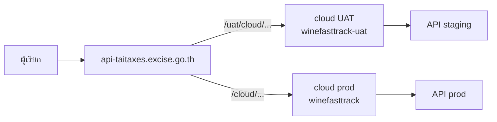

# `apiv2-Winesearch_Excise`

ลูกค้าเรียกได้เฉพาะ **internal (DC)** ไม่เรียก cloud / origin โดยตรง

| | |
|---|---|
| ผู้เรียก | ระบบงานที่ได้รับสิทธิ์เชื่อม API |
| API | `POST …/apiv2-Winesearch_Excise` |
| Source | `excise-wine-nodejs-api` |

---

## Environments

| | UAT | Production |
|---|---|---|
| **Client URL (DC)** | `https://api-taitaxes.excise.go.th/uat/cloud/apiv2-Winesearch_Excise` | `https://api-taitaxes.excise.go.th/cloud/apiv2-Winesearch_Excise` |
| DC location | **ยังไม่มี — ต้องเพิ่ม** | มีแล้ว |
| Cloud | `winefasttrack-uat.excise.go.th` | `winefasttrack.excise.go.th` |
| Origin | `excise-wine-nodejs-api-staging.devthinkbit.com` | `excise-wine-nodejs-api.devthinkbit.com` |
| Token | gen ที่ origin **staging** | gen ที่ origin **prod** |



---

## Limits (ฝั่งลูกค้า = DC)

| | ค่า |
|---|---|
| Body | **10 MB** (`client_max_body_size 10m` ระดับ server) |
| Timeout | **600s** |
| TLS | HTTPS, `TLSv1.2` / `TLSv1.3` (HTTP → 301) |

Cloud location รับ 50 MB / origin รับ 100 MB — ไม่ถึงลูกค้าถ้าติดที่ DC

`apiv2-ExciseToken` **ไม่มี location** บน DC และ cloud ทั้งสอง env — ออก token ที่ origin เท่านั้น

---

## Config files

| Layer | ไฟล์ |
|---|---|
| Internal DC | `excise-wine-proxy/remote/gateway/conf.d/api-taitaxes-excise-go-th.conf` |
| Cloud UAT | `excise-wine-proxy/aws/uat/nginx/default.conf` |
| Cloud prod | `excise-wine-proxy/aws/uat/nginx/prod.conf` |
| API | `excise-wine-nodejs-api` |

---

## 1. Cloud UAT — มีแล้ว

`server_name winefasttrack-uat.excise.go.th`

```nginx
location /cloud/apiv2-Winesearch_Excise {
    proxy_ssl_server_name on;
    proxy_ssl_name excise-wine-nodejs-api-staging.devthinkbit.com;
    proxy_set_header Host excise-wine-nodejs-api-staging.devthinkbit.com;
    client_max_body_size 50m;
    proxy_connect_timeout 600;
    proxy_send_timeout 600;
    proxy_read_timeout 600;
    proxy_pass https://excise-wine-nodejs-api-staging.devthinkbit.com/apiv2-Winesearch_Excise;
}
```

## 2. Cloud prod — มีแล้ว

`server_name winefasttrack.excise.go.th`

```nginx
location /cloud/apiv2-Winesearch_Excise {
    proxy_ssl_server_name on;
    proxy_ssl_name excise-wine-nodejs-api.devthinkbit.com;
    proxy_set_header Host excise-wine-nodejs-api.devthinkbit.com;
    client_max_body_size 50m;
    proxy_connect_timeout 600;
    proxy_send_timeout 600;
    proxy_read_timeout 600;
    proxy_pass https://excise-wine-nodejs-api.devthinkbit.com/apiv2-Winesearch_Excise;
}
```

## 3. Internal DC — prod มีแล้ว / UAT ต้องเพิ่ม

`server_name api-taitaxes.excise.go.th`

**Prod (ปัจจุบัน)**

```nginx
location /cloud/apiv2-Winesearch_Excise {
    proxy_ssl_server_name on;
    proxy_ssl_name excise-wine-nodejs-api.devthinkbit.com;
    proxy_set_header Host excise-wine-nodejs-api.devthinkbit.com;
    proxy_pass https://winefasttrack.excise.go.th/cloud/apiv2-Winesearch_Excise;
}
```

**UAT (เพิ่ม)** — ให้ลูกค้าแยก env ได้โดยไม่ต้องออกเน็ตไป cloud

```nginx
location /uat/cloud/apiv2-Winesearch_Excise {
    proxy_ssl_server_name on;
    proxy_ssl_name excise-wine-nodejs-api-staging.devthinkbit.com;
    proxy_set_header Upgrade $http_upgrade;
    proxy_set_header Connection keep-alive;
    proxy_set_header Host excise-wine-nodejs-api-staging.devthinkbit.com;
    proxy_set_header X-Forwarded-For $proxy_add_x_forwarded_for;
    proxy_set_header X-Forwarded-Proto $scheme;
    proxy_cache_bypass $http_upgrade;
    proxy_pass https://winefasttrack-uat.excise.go.th/cloud/apiv2-Winesearch_Excise;
}
```
