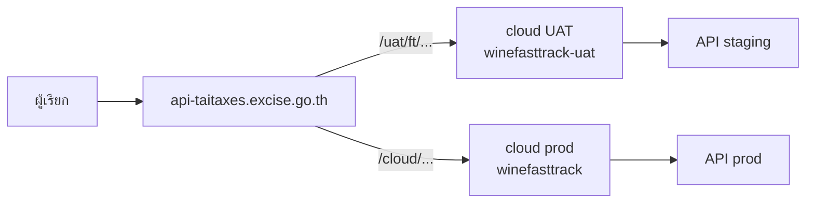

# `apiv2-Winesearch_Excise`

ลูกค้าเรียกได้เฉพาะ **internal (DC)** ไม่เรียก cloud / origin โดยตรง

| | |
|---|---|
| ผู้เรียก | ระบบงานที่ได้รับสิทธิ์เชื่อม API |
| API | `POST …/apiv2-Winesearch_Excise` |
| Source | [excise-wine-nodejs-api](https://github.com/THINKBITTH/excise-wine-nodejs-api) `staging/aws` [`c3950ca`](https://github.com/THINKBITTH/excise-wine-nodejs-api/commit/c3950ca0d80cce3f35eaf1f76c98caff400fef15) · [excise-wine-proxy](https://github.com/THINKBITTH/excise-wine-proxy) `main` [`cf51c2d`](https://github.com/THINKBITTH/excise-wine-proxy/commit/cf51c2d95fcb5176c904265e9ef3ed83a02ef102) |

---

## Environments

| | UAT | Production |
|---|---|---|
| **Client URL (DC)** | `https://api-taitaxes.excise.go.th/uat/ft/apiv2-Winesearch_Excise` | `https://api-taitaxes.excise.go.th/cloud/apiv2-Winesearch_Excise` |
| DC location | มีแล้ว [`/uat/ft/`](https://github.com/THINKBITTH/excise-wine-proxy/blob/cf51c2d95fcb5176c904265e9ef3ed83a02ef102/remote/gateway/conf.d/api-taitaxes-excise-go-th.conf#L146-L155) | มีแล้ว `/cloud/apiv2-Winesearch_Excise` |
| Cloud | `winefasttrack-uat.excise.go.th` | `winefasttrack.excise.go.th` |
| Origin | `excise-wine-nodejs-api-staging.devthinkbit.com` | `excise-wine-nodejs-api.devthinkbit.com` |
| Token | gen ที่ origin **staging** | gen ที่ origin **prod** |



---

## Limits (ฝั่งลูกค้า = DC)

| | ค่า |
|---|---|
| Body | **10 MB** (`client_max_body_size 10m` ระดับ server) |
| Timeout | **600s** |
| TLS | HTTPS, `TLSv1.2` / `TLSv1.3` (HTTP → 301) |

Cloud location รับ 50 MB / origin รับ 100 MB — ไม่ถึงลูกค้าถ้าติดที่ DC

`apiv2-ExciseToken` **ไม่มี location** บน DC และ cloud ทั้งสอง env — ออก token ที่ origin เท่านั้น

---

## Config files

| Layer | ไฟล์ |
|---|---|
| Internal DC | [`remote/gateway/conf.d/api-taitaxes-excise-go-th.conf`](https://github.com/THINKBITTH/excise-wine-proxy/blob/cf51c2d95fcb5176c904265e9ef3ed83a02ef102/remote/gateway/conf.d/api-taitaxes-excise-go-th.conf) |
| Cloud UAT | [`aws/uat/nginx/default.conf`](https://github.com/THINKBITTH/excise-wine-proxy/blob/cf51c2d95fcb5176c904265e9ef3ed83a02ef102/aws/uat/nginx/default.conf) |
| Cloud prod | [`aws/uat/nginx/prod.conf`](https://github.com/THINKBITTH/excise-wine-proxy/blob/cf51c2d95fcb5176c904265e9ef3ed83a02ef102/aws/uat/nginx/prod.conf) |
| API | [excise-wine-nodejs-api](https://github.com/THINKBITTH/excise-wine-nodejs-api) |

---

## 1. Cloud UAT — มี `/cloud/apiv2-Winesearch_Excise` แล้ว (DC UAT ไม่ใช้ path นี้)

`server_name winefasttrack-uat.excise.go.th`

ผู้เรียก UAT เข้าทาง DC `/uat/ft/` ไม่ใช่ `/cloud/` — location ด้านล่างใช้ได้ถ้าเรียก cloud โดยตรง แต่ไม่ถึงจาก `/uat/ft/`

```nginx
location /cloud/apiv2-Winesearch_Excise {
    proxy_ssl_server_name on;
    proxy_ssl_name excise-wine-nodejs-api-staging.devthinkbit.com;
    proxy_set_header Host excise-wine-nodejs-api-staging.devthinkbit.com;
    client_max_body_size 50m;
    proxy_connect_timeout 600;
    proxy_send_timeout 600;
    proxy_read_timeout 600;
    proxy_pass https://excise-wine-nodejs-api-staging.devthinkbit.com/apiv2-Winesearch_Excise;
}
```

## 2. Cloud prod — มีแล้ว

`server_name winefasttrack.excise.go.th`

```nginx
location /cloud/apiv2-Winesearch_Excise {
    proxy_ssl_server_name on;
    proxy_ssl_name excise-wine-nodejs-api.devthinkbit.com;
    proxy_set_header Host excise-wine-nodejs-api.devthinkbit.com;
    client_max_body_size 50m;
    proxy_connect_timeout 600;
    proxy_send_timeout 600;
    proxy_read_timeout 600;
    proxy_pass https://excise-wine-nodejs-api.devthinkbit.com/apiv2-Winesearch_Excise;
}
```

## 3. Internal DC — มีแล้วทั้งสอง env

`server_name api-taitaxes.excise.go.th`

**Prod**

```nginx
location /cloud/apiv2-Winesearch_Excise {
    proxy_ssl_server_name on;
    proxy_ssl_name excise-wine-nodejs-api.devthinkbit.com;
    proxy_set_header Host excise-wine-nodejs-api.devthinkbit.com;
    proxy_pass https://winefasttrack.excise.go.th/cloud/apiv2-Winesearch_Excise;
}
```

**UAT** — ใช้ [`/uat/ft/`](https://github.com/THINKBITTH/excise-wine-proxy/blob/cf51c2d95fcb5176c904265e9ef3ed83a02ef102/remote/gateway/conf.d/api-taitaxes-excise-go-th.conf#L146-L155) ที่มีอยู่ ไม่เพิ่ม `/uat/cloud/`

```nginx
location /uat/ft/ {
    proxy_set_header Upgrade $http_upgrade;
    proxy_set_header Connection keep-alive;
    proxy_set_header Host $host;
    proxy_set_header X-Forwarded-For $proxy_add_x_forwarded_for;
    proxy_set_header X-Forwarded-Proto $scheme;
    proxy_cache_bypass $http_upgrade;

    proxy_pass https://winefasttrack-uat.excise.go.th/uat/ft/;
}
```

ผู้เรียกยิง `POST /uat/ft/apiv2-Winesearch_Excise` แล้ว DC ส่งต่อไป `winefasttrack-uat.excise.go.th/uat/ft/apiv2-Winesearch_Excise`

## 4. Cloud UAT — ต้องเพิ่ม location ของ API

`server_name winefasttrack-uat.excise.go.th`

`/uat/ft/` ที่มีอยู่ชี้ frontend (`wine-fasttrack-staging`) ต้องเพิ่ม location ที่ **เฉพาะกว่า** เพื่อให้ค้นไวน์ไป origin staging

```nginx
location /uat/ft/apiv2-Winesearch_Excise {
    proxy_ssl_server_name on;
    proxy_ssl_name excise-wine-nodejs-api-staging.devthinkbit.com;
    proxy_set_header Upgrade $http_upgrade;
    proxy_set_header Connection keep-alive;
    proxy_set_header Host excise-wine-nodejs-api-staging.devthinkbit.com;
    proxy_set_header X-Forwarded-For $proxy_add_x_forwarded_for;
    proxy_set_header X-Forwarded-Proto $scheme;
    proxy_cache_bypass $http_upgrade;
    client_max_body_size 50m;
    proxy_connect_timeout 600;
    proxy_send_timeout 600;
    proxy_read_timeout 600;
    proxy_pass https://excise-wine-nodejs-api-staging.devthinkbit.com/apiv2-Winesearch_Excise;
}
```
