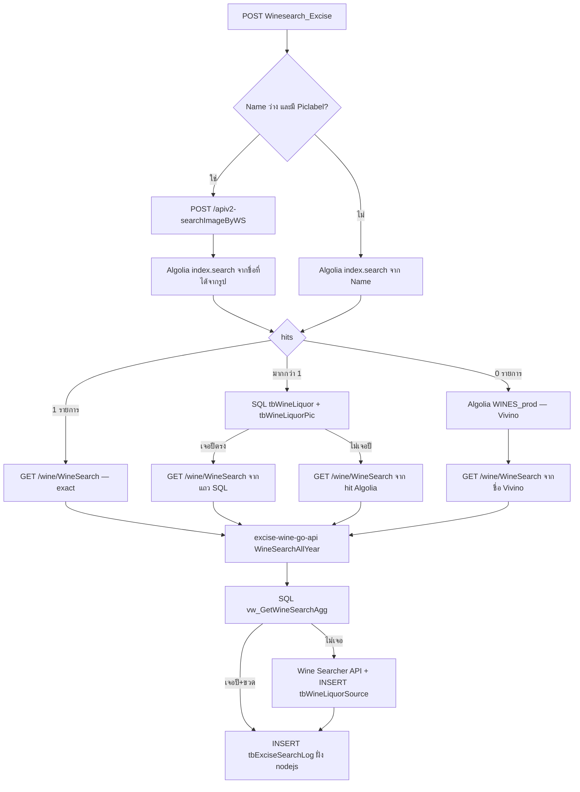

# Query ที่ `apiv2-Winesearch_Excise` ยิงต่อ

รายงานเพิ่มจาก `API_SPECT` · ฉบับภายใน Thinkbit

ดึงจาก [excise-wine-nodejs-api](https://github.com/THINKBITTH/excise-wine-nodejs-api/blob/c3950ca0d80cce3f35eaf1f76c98caff400fef15/src/app/controller/wse.ts) (`wse.ts`) และ [excise-wine-go-api](https://github.com/THINKBITTH/excise-wine-go-api/blob/d57c5add1f1b0252a5e0d03ce141d74abe5b1cfb/api/functions/wine/handler.go#L49) (`GET /wine/WineSearch`)

| | |
|---|---|
| **Audience** | Thinkbit (dev / ops) |
| **Source** | [`wse.ts`](https://github.com/THINKBITTH/excise-wine-nodejs-api/blob/c3950ca0d80cce3f35eaf1f76c98caff400fef15/src/app/controller/wse.ts) · [`WineSearchAllYear`](https://github.com/THINKBITTH/excise-wine-go-api/blob/d57c5add1f1b0252a5e0d03ce141d74abe5b1cfb/api/common/services/wineseacher.go#L447) / [`GetWineSearchAllYear`](https://github.com/THINKBITTH/excise-wine-go-api/blob/d57c5add1f1b0252a5e0d03ce141d74abe5b1cfb/api/common/repositorys/wineseacher.go#L661) |
| **Date** | 2026-08-20 |

ลิงก์ไฟล์ข้าม repo เป็น permalink ตาม commit — ถ้า HEAD ถูกแก้ ลิงก์ยังชี้จุดเดิม

| Repo | Branch | Commit |
|---|---|---|
| [excise-wine-nodejs-api](https://github.com/THINKBITTH/excise-wine-nodejs-api) | `staging/aws` | [`c3950ca`](https://github.com/THINKBITTH/excise-wine-nodejs-api/commit/c3950ca0d80cce3f35eaf1f76c98caff400fef15) |
| [excise-wine-go-api](https://github.com/THINKBITTH/excise-wine-go-api) | `staging/aws` | [`d57c5ad`](https://github.com/THINKBITTH/excise-wine-go-api/commit/d57c5add1f1b0252a5e0d03ce141d74abe5b1cfb) |

`ReqNo` / `CategoryName` จาก request ของ `apiv2-Winesearch_Excise` **ไม่ถูกใช้ใน query ค้น** ถูกเขียนลง log ฝั่ง nodejs เท่านั้น

---

## 1. ลำดับ



`GET /wine/WineSearch` ชี้ไปที่ [excise-wine-go-api](https://github.com/THINKBITTH/excise-wine-go-api) ([`handler.go`](https://github.com/THINKBITTH/excise-wine-go-api/blob/d57c5add1f1b0252a5e0d03ce141d74abe5b1cfb/api/functions/wine/handler.go#L49)) handler เรียก [`WineSearchAllYear`](https://github.com/THINKBITTH/excise-wine-go-api/blob/d57c5add1f1b0252a5e0d03ce141d74abe5b1cfb/api/common/services/wineseacher.go#L447) เสมอ ไม่เรียก [`WineSearch`](https://github.com/THINKBITTH/excise-wine-go-api/blob/d57c5add1f1b0252a5e0d03ce141d74abe5b1cfb/api/common/services/wineseacher.go#L707) แบบรายการเดียวแล้ว

---

## 2. SQL — เทียบชื่อ+ปีใน master

ยิงเมื่อ Algolia ของระบบคืน **มากกว่า 1 hit** ([`IndexSearchMoreThanOne`](https://github.com/THINKBITTH/excise-wine-nodejs-api/blob/c3950ca0d80cce3f35eaf1f76c98caff400fef15/src/app/controller/wse.ts#L267))

ตาราง: `{DATABASE_NAME}.dbo.tbWineLiquor` + `{DATABASE_NAME}.dbo.tbWineLiquorPic`  
`DATABASE_NAME` จาก `googleCloud.DATABASE_NAME`

```sql
SELECT A.DisplayName as WineName,
       B.WineLiquorYear AS Year,
       A.Country,
       B.Alcohol as AVB
FROM {DATABASE_NAME}.dbo.tbWineLiquor AS A
INNER JOIN {DATABASE_NAME}.dbo.tbWineLiquorPic AS B
  ON A.Id = B.WineLiquorId
WHERE A.DisplayName = N'{winename}'
  AND B.WineLiquorYear = '{Vintage}';
```

| พารามิเตอร์ | มาจาก |
|---|---|
| `{winename}` | `index_search[i].name` หลังแทน `'` เป็น `''` |
| `{Vintage}` | `reqModel.Vintage` เช่น `"1993"` |

ผล:

- `recordset.length === 0` → ยิง `/wine/WineSearch` ด้วยชื่อ/ประเทศ/แอลกอฮอล์จาก hit Algolia และปีจาก request
- `recordset.length > 0` → เก็บแถวแรก แล้วยิง `/wine/WineSearch` ด้วย `WineName` / `Year` / `Country` / `AVB` จาก SQL

`CategoryName` / `ReqNo` / `Country` / `Region` จาก **request ไม่ได้อยู่ใน WHERE**

---

## 3. SQL — เก็บ log

ยิงทุกครั้งที่ค้นจบ (พบ / ใกล้เคียง / ไม่พบ / 500 ตอน search) — **ไม่ยิง** เมื่อ `401` หรือ `400` ([`wse.ts` insert `tbExciseSearchLog`](https://github.com/THINKBITTH/excise-wine-nodejs-api/blob/c3950ca0d80cce3f35eaf1f76c98caff400fef15/src/app/controller/wse.ts#L830))

```sql
INSERT INTO [dbo].[tbExciseSearchLog] (
  [Reqno], [Winename], [Categoryname], [Vintage], [Bottlesize], [AVB],
  [Country], [Region], [Create_date], [Create_by], [Update_date], [Update_by],
  [Status], [IP], [Agent], [Request], [Response]
) VALUES (
  @Reqno, @Winename, @Categoryname, @Vintage, @Bottlesize, @AVB,
  @Country, @Region, @Create_date, @Create_by, @Update_date, @Update_by,
  @Status, @IP, @Agent, @Request, @Response
);
```

| พารามิเตอร์ | มาจาก |
|---|---|
| `@Reqno` | `reqModel.ReqNo` |
| `@Winename` | `reqModel.Name` |
| `@Categoryname` | `reqModel.CategoryName` |
| `@Vintage` | `reqModel.Vintage` |
| `@Bottlesize` | `reqModel.BottleSize` (ค่าดิบ เช่น `750ml`) |
| `@AVB` | `reqModel.Avb` |
| `@Country` | `reqModel.Country` |
| `@Region` | `reqModel.Region` |
| `@Create_by` / `@Update_by` | `uid` ใน JWT |
| `@Status` | `"Found"` เมื่อ `winedata.length === 1` · `"Not found"` เมื่อหลายรายการหรือ error ตอน search |
| `@IP` | `request.ip` หรือ `x-forwarded-for` |
| `@Agent` | `JSON.stringify(request.headers)` |
| `@Request` | `JSON.stringify(reqModel)` ทั้งก้อน รวม `Piclabel` |
| `@Response` | `JSON.stringify(resModel)` ทั้งก้อน |

---

## 4. `GET /wine/WineSearch` — [excise-wine-go-api](https://github.com/THINKBITTH/excise-wine-go-api)

Nodejs ยิง

```
GET {URL_SELF}/wine/WineSearch
  ?Winename={encoded}
  &Vintage={year}
  &Location={country}
  &AVB={alcohol}
  &BottleSize={mapped size}
  &Currencycode=THB
  &uid=12
  &BottleCode={code}
```

`URL_SELF` ค่าเริ่ม `https://asia-southeast1-tbit-excise.cloudfunctions.net`  
route ใน go-api: Cloud Function `/WineSearch` หรือ local `/api/wine/WineSearch`

`BottleSize` ใน URL เป็นชื่อที่ map แล้ว เช่น `Bottle (750ml)` ไม่ใช่ `750ml`  
`BottleCode` เช่น `B` / `h` / `m` / `dm` / `O`  
nodejs **ไม่ได้ส่ง** `wineType`

| กิ่งฝั่ง nodejs | Winename | Vintage | Location | AVB |
|---|---|---|---|---|
| Algolia 1 hit | ชื่อจาก hit | request | `index_search[0].country` | `index_search[0].alcohol` |
| SQL ไม่เจอปี | ชื่อจาก hit | request | ประเทศจาก hit | แอลกอฮอล์จาก hit |
| SQL เจอปี | `WineName` จาก SQL | `Year` จาก SQL | `Country` จาก SQL | `AVB` จาก SQL |
| Algolia 0 hit แล้วไป Vivino | ชื่อจาก Vivino | request | ว่าง | `0` |
| high ranking | ชื่อจาก hit | request | ประเทศจาก hit | แอลกอฮอล์จาก hit |

handler ([`handler.go`](https://github.com/THINKBITTH/excise-wine-go-api/blob/d57c5add1f1b0252a5e0d03ce141d74abe5b1cfb/api/functions/wine/handler.go#L49)) parse query แล้วเรียก **[`WineSearchAllYear`](https://github.com/THINKBITTH/excise-wine-go-api/blob/d57c5add1f1b0252a5e0d03ce141d74abe5b1cfb/api/common/services/wineseacher.go#L447)** เท่านั้น

ถ้า `AVB=0` และ `Location` ว่าง จะบังคับ `Location=""` / `AVB=0` ก่อนเข้า service (กิ่ง Vivino ของ nodejs ตรงนี้)

response เป็น `{ code, data, message, status }` โดย `data` เป็น **array** (`[]WineSeacherRespondWithTax`) — ฝั่ง [`wse.ts`](https://github.com/THINKBITTH/excise-wine-nodejs-api/blob/c3950ca0d80cce3f35eaf1f76c98caff400fef15/src/app/controller/wse.ts) จึงเข้ากิ่ง `data.length > 0` (ใกล้เคียง) เมื่อมีแถว

### 4.1 ลำดับใน go-api

1. `INSERT tbWineSearchLog` แบบ async
2. `SELECT` จาก `vw_GetWineSearchAgg` ([`GetWineSearchAllYear`](https://github.com/THINKBITTH/excise-wine-go-api/blob/d57c5add1f1b0252a5e0d03ce141d74abe5b1cfb/api/common/repositorys/wineseacher.go#L661))
3. ใน memory: ตัดแถวปีว่าง / `NV` แล้ว filter `BottleSize` ถ้า request ส่งมา
4. ถ้ามีแถวและปีตรง `Vintage` → คืนผล (บวกภาษี)
5. ถ้าไม่มีแถว หรือมีแต่ปีไม่ตรง → `wineSearchRealtime` (Wine-Searcher API)

### 4.2 SQL หลัก — `vw_GetWineSearchAgg`

[`GetWineSearchAllYear`](https://github.com/THINKBITTH/excise-wine-go-api/blob/d57c5add1f1b0252a5e0d03ce141d74abe5b1cfb/api/common/repositorys/wineseacher.go#L661) · `DB_NAME` ค่าเริ่ม `ExciseInfo`

`BottleSize` **ไม่อยู่ใน WHERE** กรองทีหลังใน Go  
`AVB` อยู่ใน WHERE เฉพาะเมื่อ `AVB != 0`  
`wineType == 2` ถึงจะจำกัด `CategoryId IN (2, 4)` — nodejs ไม่ส่ง จึงไม่ติด

```sql
SELECT Id, WineLiquorId, WineName, CategoryId, CategoryName, BottleSize, AVB,
       AvgPrice, ModePrice, MedianPrice, RecommendModePrice, RecommendMedianPrice,
       RecommendAvgPrice, RecommendMaxPrice, RecommendMinPrice,
       RecommendModePriceByCountry, RecommendMedianPriceCountry,
       RecommendAvgPriceByCountry, RecommendMaxPriceByCountry, RecommendMinPriceByCountry,
       CreatedBy, UpdatedBy, ISNULL([Year],'') AS [Year],
       ISNULL(Color,'') AS Color, ISNULL(SubType,'') AS SubType, ISNULL(Country,'') AS Country,
       ISNULL([Path],'') AS [Path], ISNULL(Region,'') AS Region, ISNULL(SubRegion,'') AS SubRegion,
       ISNULL(ClassAbbreviation,'') AS ClassAbbreviation, ISNULL(ClassDescription,'') AS ClassDescription,
       CreatedDate, UpdatedDate, 0 AS RowNum
FROM {DB_NAME}.[dbo].[vw_GetWineSearchAgg]
WHERE WineName = N'{winename}'
  -- AND AVB = {avb}          เมื่อ AVB != 0
  -- AND CategoryId IN (2, 4) เมื่อ wineType == 2
ORDER BY [Year] DESC, BottleSize
```

ตัวอย่างจาก request `CHATEAU MOUTON ROTHSCHILD` / `1993` / `750ml` เมื่อ Algolia ส่ง AVB มาด้วย:

```sql
SELECT ... FROM ExciseInfo.[dbo].[vw_GetWineSearchAgg]
WHERE WineName = N'Chateau Mouton Rothschild'
  AND AVB = 12.5
ORDER BY [Year] DESC, BottleSize
```

จากนั้น Go เหลือเฉพาะ `Year = '1993'` และขวดที่ match `Bottle (750ml)`  
ไม่เจอปีนี้ → ไปข้อ 4.4

view นี้เป็นผลรวมราคาต่อปี/ขวด (GROUP / AVG จากหลายประเทศ) ไม่ใช่ `vw_GetWineSearch` แถวดิบ

### 4.3 SQL log ฝั่ง go-api

ทุกครั้งที่เข้า `WineSearchAllYear` (ไม่รอผลค้น) — [`SaveSearchLog`](https://github.com/THINKBITTH/excise-wine-go-api/blob/d57c5add1f1b0252a5e0d03ce141d74abe5b1cfb/api/common/repositorys/wineseacher.go#L792)

```sql
INSERT INTO [dbo].[tbWineSearchLog] ([WineName], [CreatedDate], [CreatedBy], [UpdatedDate], [UpdatedBy])
VALUES (?, ?, ?, ?, ?)
```

`CreatedBy` / `UpdatedBy` = `uid` จาก query (`12` ตามที่ nodejs ล็อกไว้)

คนละตารางกับ `tbExciseSearchLog` ฝั่ง nodejs

### 4.4 Fallback — ไม่เจอใน view / ปีไม่ตรง

[`wineSearchRealtime`](https://github.com/THINKBITTH/excise-wine-go-api/blob/d57c5add1f1b0252a5e0d03ce141d74abe5b1cfb/api/common/services/wineseacher.go#L1483):

1. HTTP Wine-Searcher (อย่าใส่ api-key ในเอกสาร)

```
GET https://api.wine-searcher.com/a
  ?winename={ชื่อหลัง SpanishReplacer}
  &vintage={ปี หรือ 2 = ทุกปี}
  &offer_type=R
  &bottle_size={B/H/M/...}
  &autoexpand=Y
  &format=J
  &currencycode=THB
```

2. `INSERT` ทีละร้านลง `{DB_NAME}.dbo.tbWineLiquorSource` (`WineLiquorName`, `MerchantName`, `Address`, `Country`, `Vintage`, `Price`, `BottleSize`, `LinkShop`, `Description`, `WineliquorId`, `Usable`)
3. ถ้าร้านเยอะ / coverage ต่ำ

```sql
EXEC dbo.usp_get_low_coverage_750ml_years_by_exact_wine_name
  @WineLiquorName = ?, @StartYear = 1980, @EndYear = 2025, @TopN = ?,
  @OnlyUsable = 1, @ExcludeExciseDepartment = 1, @ExcludeThailand = 1
```

แล้วยิง Wine-Searcher ซ้ำรายปี (`reSearchByYear`)

4. รวมราคาจาก source

```sql
EXEC dbo.usp_get_live_price_by_exact_wine_name_from_source
  @WineLiquorName = ?, @MonthsBack = 6, @OnlyUsable = 1,
  @ExcludeExciseDepartment = 1, @ExcludeThailand = 1
```

ถ้า realtime ก็ไม่เจอ → HTTP 404 `ไม่พบข้อมูลสุราที่ต้องการค้นหา` · ฝั่ง nodejs มักได้ `code !== 200` แล้วเข้ากิ่งไม่พบ

### 4.5 Path เก่าใน repo ที่ handler ไม่เรียกแล้ว

[`WineSearch`](https://github.com/THINKBITTH/excise-wine-go-api/blob/d57c5add1f1b0252a5e0d03ce141d74abe5b1cfb/api/common/services/wineseacher.go#L707) (รายการเดียว) ยังมีใน [`wineseacher.go`](https://github.com/THINKBITTH/excise-wine-go-api/blob/d57c5add1f1b0252a5e0d03ce141d74abe5b1cfb/api/common/services/wineseacher.go) แต่ [`handler.go`](https://github.com/THINKBITTH/excise-wine-go-api/blob/d57c5add1f1b0252a5e0d03ce141d74abe5b1cfb/api/functions/wine/handler.go#L147) comment ไว้แล้ว ไม่ถูกใช้จาก `/wine/WineSearch` ปัจจุบัน

ถ้าถูกเรียก จะใช้ `vw_GetWineSearch` ไม่ใช่ Agg:

```sql
-- มีปี
SELECT ... FROM [dbo].[vw_GetWineSearch]
WHERE WineName = N'{winename}' AND BottleSize = ? AND Year = ?
ORDER BY CreatedDate DESC

-- ปีว่าง หรือ UV
SELECT ... FROM [dbo].[vw_GetWineSearch]
WHERE WineName = N'{winename}' AND BottleSize = ?
ORDER BY CreatedDate DESC
```

และอาจ `EXEC CalculateWinePrice` / `EXEC sp_del_wineliquorsource` / `CheckWineById` บน `tbWineLiquor`

อย่าใช้ชุดนี้เป็นสัญญาของ `apiv2-Winesearch_Excise` ตอนนี้

---

## 5. Algolia — index ของระบบ

ค้นจากชื่อ (`highRankingUseWineName`) เมื่อ `Name` ไม่ว่าง

```
index.search(Name, { getRankingInfo: true })
```

index จาก `ALGOLIA_INDEX` · ใช้แค่ **5 hit แรก**  
hit ที่ `fullyHighlighted && matchLevel == "full"` เข้า `datahighranking` ด้วย (ไปยิง WineSearch ซ้ำ)

ค้นจากรูป หลังได้ชื่อจาก Wine-Searcher:

```
index.search(wine_name_display, { optionalWords: Name.split(" ") })
```

ตอนค้นจากรูป `Name` เป็น `""` ดังนั้น `optionalWords` เป็น `[""]`

---

## 6. Algolia — `WINES_prod` (Vivino)

ยิงเมื่อ index ของระบบคืน **0 hit** (`IndexSearchZero`)

```
POST https://9takgwjuxl-dsn.algolia.net/1/indexes/WINES_prod/query
Content-Type: application/json

{ "params": "query={encoded Name}&hitsPerPage=5" }
```

application id ฝังใน URL ของโค้ด (อย่าใส่ api-key ในเอกสารนี้)

ถ้ามี hit ที่ชื่อตรงเต็ม (`fullyHighlighted` + `matchLevel == full`) ใช้ `vintages[0].name` ไปยิง WineSearch  
ถ้าไม่มี วน hit ที่เหลือ (ตัดอักขระพิเศษก่อน)

---

## 7. ค้นจากรูป

เมื่อ `Name === ""` และ `Piclabel` ไม่ว่างหลัง trim

1. Origin ยิงตัวเอง

```
POST {URL_SELF}/apiv2-searchImageByWS
Content-Type: application/json

{ "image": "{Piclabel}" }
```

2. `apiv2-searchImageByWS` ส่งต่อไป Wine-Searcher

```
POST https://imgapi.wine-searcher.com/imageMatcherThirdParty.php
Content-Type: application/x-www-form-urlencoded

image={Piclabel}&userId={ws userid}&password={ws salt}&matching_key={hmac}&currency=THB
```

3. เอา `wine_name_display` ของผลแรก (ถ้าว่างไม่ใช้) ไป `index.search` ตามข้อ 5

---

## 8. สรุป — อะไรถูก query / อะไรไม่ถูก

| ฟิลด์ request | ใช้ใน query ค้น? | ไปที่ไหน |
|---|---|---|
| `Name` | ใช่ | Algolia / Vivino / WineSearch `Winename` / log ทั้งสองฝั่ง |
| `Vintage` | ใช่ | SQL master `WineLiquorYear` · go-api filter ปีหลัง `vw_GetWineSearchAgg` · log |
| `BottleSize` | ใช่ | map เป็นชื่อขวด แล้ว Go filter ใน memory (ไม่ได้อยู่ใน WHERE ของ Agg) / log เก็บค่าดิบ |
| `Avb` | ไม่ตรงจาก request | log ฝั่ง nodejs · WineSearch ใช้ `AVB` จาก Algolia/SQL ใน WHERE ของ Agg เมื่อค่าไม่เป็น 0 |
| `Country` / `Region` | ไม่ | log ฝั่ง nodejs · `Location` ของ WineSearch ไม่ได้อยู่ใน WHERE ของ Agg ใช้ตอน fallback realtime |
| `ReqNo` | ไม่ | `tbExciseSearchLog` เท่านั้น |
| `CategoryName` | ไม่ | `tbExciseSearchLog` เท่านั้น |
| `Piclabel` | ใช่เมื่อค้นจากรูป | `apiv2-searchImageByWS` และ JSON `Request` ใน `tbExciseSearchLog` |
